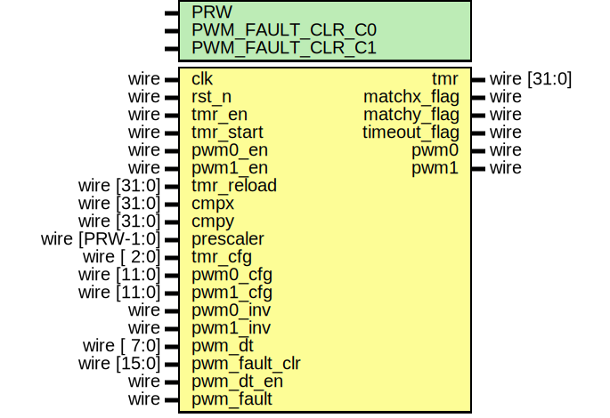

# EF_TMR32

 A 32-bit timer and PWM generator with the following features:
- 32-bit prescaler.
- Up Counting, Down Counting and Up/Down Counting.
- One-shot and Periodic.
- Two independent PWM channels with two compare registers.
- Optional PWM signal inversion.
- Configurable PWM dead time/band to generate PWM signals such as those required by a half-H bridge driver.
- Fault handling.

## The wrapped IP


 APB, AHBL, and Wishbone wrappers are provided. All wrappers provide the same programmer's interface as outlined in the following sections.

### Wrapped IP System Integration

Based on your use case, use one of the provided wrappers or create a wrapper for your system bus type. For an example of how to integrate the wishbone wrapper:
```verilog
EF_TMR32_WB INST (
	.clk_i(clk_i),
	.rst_i(rst_i),
	.adr_i(adr_i),
	.dat_i(dat_i),
	.dat_o(dat_o),
	.sel_i(sel_i),
	.cyc_i(cyc_i),
	.stb_i(stb_i),
	.ack_o(ack_o),
	.we_i(we_i), 
	.IRQ(irq),
	.pwm0(pwm0),
	.pwm1(pwm1),
	.pwm_fault(pwm_fault)
);
```
### Wrappers with DFT support
Wrappers in the directory ``/hdl/rtl/bus_wrappers/DFT`` have an extra input port ``sc_testmode`` to disable the clock gate whenever the scan chain testmode is enabled.
### External IO interfaces
|IO name|Direction|Width|Description|
|---|---|---|---|
|pwm0|output|1|Output of pwm0 ; this signal is a square wave where the width of the pulse (on time) is varied to control the power delivered to a load, often used for controlling motors, lights, and other devices.|
|pwm1|output|1|Output of pwm1 ; this signal is a square wave where the width of the pulse (on time) is varied to control the power delivered to a load, often used for controlling motors, lights, and other devices.|
|pwm_fault|input|1|This is a signal that indicates a fault or error condition in the PWM system, typically used for safety purposes to shut down or adjust the operation of the device in case of malfunction.|
### Interrupt Request Line (irq)
This IP generates interrupts on specific events, which are described in the [Interrupt Flags](#interrupt-flags) section bellow. The IRQ port should be connected to the system interrupt controller.

## Implementation example  

The following table is the result for implementing the EF_TMR32 IP with different wrappers using Sky130 HD library and [OpenLane2](https://github.com/efabless/openlane2) flow.
|Module | Number of cells | Max. freq |
|---|---|---|
|EF_TMR32|797| 163 |
|EF_TMR32_APB|1435|135|
|EF_TMR32_AHBL|1501|128|
|EF_TMR32_WB|1669|63|
## The Programmer's Interface


### Registers

|Name|Offset|Reset Value|Access Mode|Description|
|---|---|---|---|---|
|TMR|0000|0x00000000|r|The current value of the Timer.|
|RELOAD|0004|0x00000000|w|The timer reload value. In up counting it is used as the terminal count. For down counting it is used as the initial count.|
|PR|0008|0x00000000|w|The Prescaler. The timer counting frequency is $Clock\ freq/(PR + 1)$|
|CMPX|000c|0x00000000|w|Compare Register X.|
|CMPY|0010|0x00000000|w|Compare Register Y.|
|CTRL|0014|0x00000000|w|Control Register.|
|CFG|0018|0x00000000|w|Configuration Register.|
|PWM0CFG|001c|0x00000000|w|PWM0 Configuration Register.|
|PWM1CFG|0020|0x00000000|w|PWM1 Configuration Register.|
|PWMDT|0024|0x00000000|w|PWM deadtime Register.|
|PWMFC|0028|0x00000000|w|PWM fault clear register.|
|IM|ff00|0x00000000|w|Interrupt Mask Register; write 1/0 to enable/disable interrupts; check the interrupt flags table for more details|
|RIS|ff08|0x00000000|w|Raw Interrupt Status; reflects the current interrupts status;check the interrupt flags table for more details|
|MIS|ff04|0x00000000|w|Masked Interrupt Status; On a read, this register gives the current masked status value of the corresponding interrupt. A write has no effect; check the interrupt flags table for more details|
|IC|ff0c|0x00000000|w|Interrupt Clear Register; On a write of 1, the corresponding interrupt (both raw interrupt and masked interrupt, if enabled) is cleared; check the interrupt flags table for more details|
|GCLK|ff10|0x00000000|w|Gated clock enable; 1: enable clock, 0: disable clock|

### TMR Register [Offset: 0x0, mode: r]

The current value of the Timer.


### RELOAD Register [Offset: 0x4, mode: w]

The timer reload value. In up counting it is used as the terminal count. For down counting it is used as the initial count.


### PR Register [Offset: 0x8, mode: w]

The Prescaler. The timer counting frequency is $Clock\ freq/(PR + 1)$


### CMPX Register [Offset: 0xc, mode: w]

Compare Register X.


### CMPY Register [Offset: 0x10, mode: w]

Compare Register Y.


### CTRL Register [Offset: 0x14, mode: w]

Control Register.


|bit|field name|width|description|
|---|---|---|---|
|0|TE|1|Timer enable|
|1|TS|1|Timer re-start; used in the one-shot mode to restart the timer. Write 1 then 0 to re-start the timer.|
|2|P0E|1|PWM 0 enable|
|3|P1E|1|PWM 1 enable|
|4|DTE|1|PWM deadtime enable|
|5|PI0|1|Invert PWM0 output.|
|6|PI1|1|Invert PWM1 output.|

### CFG Register [Offset: 0x18, mode: w]

Configuration Register.


|bit|field name|width|description|
|---|---|---|---|
|0|DIR|2|Count direction; 10: Up, 01: Down, 11: Up/Down|
|2|P|1|1: Periodic, 0: One Shot|

### PWM0CFG Register [Offset: 0x1c, mode: w]

PWM0 Configuration Register.


|bit|field name|width|description|
|---|---|---|---|
|0|E0|2|PWM0 action for matching zero. 00: No Action, 01: Low, 10: High, 11: Invert|
|2|E1|2|PWM0 action for matching CMPX (going up). 00: No Action, 01: Low, 10: High, 11: Invert|
|4|E2|2|PWM0 action for matching CMPY (going up). 00: No Action, 01: Low, 10: High, 11: Invert|
|6|E3|2|PWM0 action for matching RELOAD. 00: No Action, 01: Low, 10: High, 11: Invert|
|8|E4|2|PWM0 action for  matching CMPY (going down). 00: No Action, 01: Low, 10: High, 11: Invert|
|10|E5|2|PWM0 action for matching CMPX (going down). 00: No Action, 01: Low, 10: High, 11: Invert|

### PWM1CFG Register [Offset: 0x20, mode: w]

PWM1 Configuration Register.


|bit|field name|width|description|
|---|---|---|---|
|0|E0|2|PWM1 action for matching zero. 00: No Action, 01: Low, 10: High, 11: Invert|
|2|E1|2|PWM1 action for matching CMPX (going up). 00: No Action, 01: Low, 10: High, 11: Invert|
|4|E2|2|PWM1 action for matching CMPY (going up). 00: No Action, 01: Low, 10: High, 11: Invert|
|6|E3|2|PWM1 action for matching RELOAD. 00: No Action, 01: Low, 10: High, 11: Invert|
|8|E4|2|PWM1 action for matching CMPY (going down). 00: No Action, 01: Low, 10: High, 11: Invert|
|10|E5|2|PWM1 action for matching CMPX (going down). 00: No Action, 01: Low, 10: High, 11: Invert|

### PWMDT Register [Offset: 0x24, mode: w]

PWM deadtime Register.


### PWMFC Register [Offset: 0x28, mode: w]

PWM fault clear register.


### GCLK Register [Offset: 0xff10, mode: w]

 Gated clock enable register


|bit|field name|width|description|
|---|---|---|---|
|0|gclk_enable|1|Gated clock enable; 1: enable clock, 0: disable clock|


### Interrupt Flags

The wrapped IP provides four registers to deal with interrupts: IM, RIS, MIS and IC. These registers exist for all wrapper types.

Each register has a group of bits for the interrupt sources/flags.
- `IM` [offset: ``0xff00``]: is used to enable/disable interrupt sources.

- `RIS` [offset: ``0xff08``]: has the current interrupt status (interrupt flags) whether they are enabled or disabled.

- `MIS` [offset: ``0xff04``]: is the result of masking (ANDing) RIS by IM.

- `IC` [offset: ``0xff0c``]: is used to clear an interrupt flag.


The following are the bit definitions for the interrupt registers:

|Bit|Flag|Width|Description|
|---|---|---|---|
|0|TO|1|Timeout; TMR matches 0 (down counting) or RELOAD (up counting).|
|1|MX|1|TMR matches CMPX register.|
|2|MY|1|TMR matches CMPY register.|
### Clock Gating
The IP includes a clock gating feature that allows selective activation and deactivation of the clock using the ``GCLK`` register. This capability is implemented through the ``ef_util_gating_cell`` module, which is part of the common modules library, [ef_util_lib.v](https://github.com/efabless/EF_IP_UTIL/blob/main/hdl/ef_util_lib.v). By default, the clock gating is disabled. To enable behavioral implmentation clock gating, only for simulation purposes, you should define the ``CLKG_GENERIC`` macro. Alternatively, define the ``CLKG_SKY130_HD`` macro if you wish to use the SKY130 HD library clock gating cell, ``sky130_fd_sc_hd__dlclkp_4``.

**Note:** If you choose the [OpenLane2](https://github.com/efabless/openlane2) flow for implementation and would like to enable the clock gating feature, you need to add ``CLKG_SKY130_HD`` macro to the ``VERILOG_DEFINES`` configuration variable. Update OpenLane2 YAML configuration file as follows: 
```
VERILOG_DEFINES:
- CLKG_SKY130_HD
```
## Firmware Drivers:
Firmware drivers for EF_TMR32 can be found in the [EF_TMR32](https://github.com/efabless/EF_APIs_HUB/tree/main/EF_TMR32) directory in the [EF_APIs_HUB](https://github.com/efabless/EF_APIs_HUB) repo. EF_TMR32 driver documentation  is available [here](https://github.com/efabless/EF_APIs_HUB/tree/main/EF_TMR32/README.md).
You can also find an example C application using the EF_TMR32 drivers [here](https://github.com/efabless/EF_APIs_HUB/tree/main/EF_TMR32/EF_TMR32_example.c).
## Installation:
You can install the IP either by cloning this repository or by using [IPM](https://github.com/efabless/IPM).
### 1. Using [IPM](https://github.com/efabless/IPM):
- [Optional] If you do not have IPM installed, follow the installation guide [here](https://github.com/efabless/IPM/blob/main/README.md)
- After installing IPM, execute the following command ```ipm install EF_TMR32```.
> **Note:** This method is recommended as it automatically installs [EF_IP_UTIL](https://github.com/efabless/EF_IP_UTIL.git) as a dependency.
### 2. Cloning this repo: 
- Clone [EF_IP_UTIL](https://github.com/efabless/EF_IP_UTIL.git) repository, which includes the required modules from the common modules library, [ef_util_lib.v](https://github.com/efabless/EF_IP_UTIL/blob/main/hdl/ef_util_lib.v).
```git clone https://github.com/efabless/EF_IP_UTIL.git```
- Clone the IP repository
```git clone github.com/efabless/EF_TMR32/tree/main```

### The Wrapped IP Interface 

>**_NOTE:_** This section is intended for advanced users who wish to gain more information about the interface of the wrapped IP, in case they want to create their own wrappers.



#### Module Parameters 

|Parameter|Description|Default Value|
|---|---|---|
|PRW|Number of bits for the prescaler register|16|

#### Ports 

|Port|Direction|Width|Description|
|---|---|---|---|
|pwm0|output|1|Output of pwm0 ; this signal is a square wave where the width of the pulse (on time) is varied to control the power delivered to a load, often used for controlling motors, lights, and other devices.|
|pwm1|output|1|Output of pwm1 ; this signal is a square wave where the width of the pulse (on time) is varied to control the power delivered to a load, often used for controlling motors, lights, and other devices.|
|pwm_fault|input|1|This is a signal that indicates a fault or error condition in the PWM system, typically used for safety purposes to shut down or adjust the operation of the device in case of malfunction.|
|tmr_en|input|1|Flag to enable timer|
|tmr_start|input|1|Flag to make tmr start in one shot mode|
|pwm0_en|input|1|Enable signal for PWM0 generation|
|pwm1_en|input|1|Enable signal for PWM1 generation|
|tmr_reload|input|32|The reload value which the counter will reach or start from|
|cmpx|input|32|The compare value X|
|cmpy|input|32|The compare value Y|
|prescaler|input|PRW|Prescaler value; Timer frequency = clock frequency / (prescaler + 1)|
|tmr_cfg|input|3|Timer configuration value; periodic or one shot and counting direction|
|pwm0_cfg|input|12|Actions configuration for pwm0|
|pwm1_cfg|input|12|Actions configuration for pwm1|
|pwm0_inv|input|1|Invert pwm0 signal|
|pwm1_inv|input|1|Invert pwm1 signal|
|pwm_dt|input|8|Deadtime for pwm|
|pwm_fault_clr|input|16|PWM fault input|
|pwm_dt_en|input|1|PWM deadtime enable|
|tmr|output|32|The actual value for the timer|
|matchx_flag|output|1|Flag raised when matching compare value x|
|matchy_flag|output|1|Flag raised when matching compare value x|
|timeout_flag|output|1|Flag raised when timeout happen|
